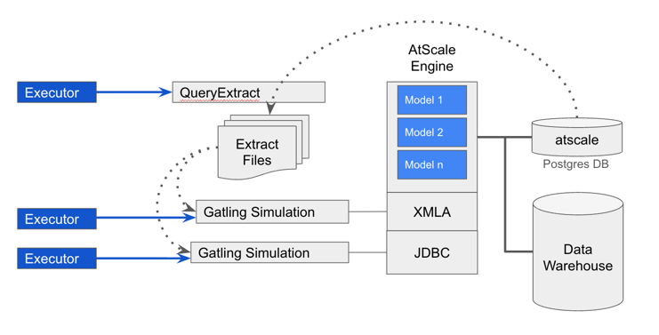

# atscale-gatling
### Overview

Gatling test harness for AtScale. Uses the atscale-gatling-core library to run regression, load, and performance tests.

Project uses the open jdk temurin-21.

This project is intended to be a simple way to run Gatling tests against AtScale.  It uses the atscale-gatling-core library to do the heavy lifting: https://github.com/AtScaleInc/atscale-gatling-core  This project is much simpler than atscale-gatling-core and is easier to extend and modify.  It is intended to be a starting point for users who want to build their own Gatling test harness for AtScale.

Let us put this into context.  A simplified AtScale architecture is shown below:


Our approach is simple.  We impersonate BI Tools by leveraging Gatling to simulate user activity.  Since the atscale database contains a history of the BI queries run by the engine against the Data Warehouse, we are able to extract the queries executed against AtSale by the BI Tools and run them using automation.


This is incredibly powerful.  Not only can we run regression tests, but we can easily emulate various user loads by shaping our simulations.

We enable a two step process, which provides an opportunity to modify query extracts to perhaps filter which queries to run.  To achieve this goal first we run query extract.  Subsequently, we run simulations.


The simulations consume the query extracts and run them against the AtScale Engine.  They produce results in the form of Gatling HTML reports and run_logs.

Query extract executors facilitate query extraction.  Simulation executors are designed to run simulations either sequentially or concurrently.  Generally, this is achieved by choosing a sequential or concurrent executor example and updating with configurations for your environment and models under test.




Alternatively, you can create your own query files and place them in the /ingest directory.


### Quick Start
Prerequisites should you choose to run this project:
1. Java 21 (temurin-21)
2. Run a shell command to install the Hive JDBC driver found in the /lib directory to the maven repository.
3. Configure systems.properties file

##### All commands should be run from the root directory of the project.

Install Hive Driver

MacOS or Linux Run this command
```shell
./mvnw -X install:install-file -Dfile=./lib/hive-jdbc-uber-2.6.3.0-235.jar -DpomFile=./lib/hive-jdbc-uber-2.6.3.0-235.pom
```
Windows Run this command
```shell
.\mvnw.cmd -X install:install-file -Dfile=".\lib\hive-jdbc-uber-2.6.3.0-235.jar"  -DpomFile=".\lib\hive-jdbc-uber-2.6.3.0-235.pom"
```

Configure systems.properties file

To get started create a properties file named systems.properties in the src/main/resources directory.  The file should be modeled after the example_systems.properties file in the same directory.  The properties file should contain the following properties:
1. A list of models -- the models are defined in your AtScale environment, replacing the literals model1,model2,model3 in the properties file.
2. The JDBC URL to connect to the AtScale Postgres Database where system configuration data and query data is stored.  The database is named atscale.
3. The username and password to connect to the AtScale Postgres Database
4. A set of properties to connect to the AtScale JDBC endpoint for each model.  AtScale emulates Postgres so the JDBC URL looks similar to the AtScale database where system configuration is stored.
5. A set of properties to connect to the AtScale XMLA endpoint for each model.

```
atscale.models=model1,model2,model3
atscale.jdbc.url=jdbc:postgresql://your_host:your_port/atscale
atscale.jdbc.username=your_username
atscale.jdbc.password=your_password
atscale.model1.jdbc.url=jdbc:postgresql://your_host:your_port/your_catalog
atscale.model1.jdbc.username=your_keycloak_username
atscale.model1.jdbc.password=your_keycloak_password
atscale.model1.jdbc.maxPoolSize=10
atscale.model_1.jdbc.log.resultset.rows=true
atscale.model2.jdbc.url=jdbc:postgresql://your_host:your_port/your_catalog
atscale.model2.jdbc.username=your_keycloak_username
atscale.model2.jdbc.password=your_keycloak_password
atscale.model2.jdbc.maxPoolSize=10
atscale.model_2.jdbc.log.resultset.rows=false
atscale.model3.jdbc.url=jdbc:postgresql://your_host:your_port/your_catalog
atscale.model3.jdbc.username=your_keycloak_username
atscale.model3.jdbc.password=yuor_keycloak_password
atscale.model3.jdbc.maxPoolSize=10
atscale.model_3.jdbc.log.resultset.rows=true
atscale.model1.xmla.url=your_atscale_xmla_url_with_access_token
atscale.model1.xmla.cube=cube_name_for_model1
atscale.model1.xmla.catalog=catalog_name_for_model1
atscale.model1.xmla.log.responsebody=true
```  
The list of models is comma separated.  Copy and paste the model names directly from the AtScale UI.
In Java, properties may have spaces, so model names with spaces are supported.
However, property keys cannot have spaces.  Therefore, in the property keys we replace spaces with underscores.  For example, if your model name is Sales Model, then the property key would be atscale.Sales_Model.jdbc.url, etc.


Optionally enable logging of result sets and XMLA response bodies.  

Logging uses async logging defined in the log4j2.xml file, where adjustments can be made to the buffersize property for the async loggers.

##### Optional Properties
The following properties are optional.  If not provided, default values will be used.
```
atscale.gatling.throttle.ms=5
atscale.xmla.maxConnectionsPerHost=20
atscale.xmla.useAggregates=true
atscale.xmla.generateAggregates=false
atscale.xmla.useQueryCache=false
atscale.xmla.useAggregateCache=true
atscale.jdbc.useAggregates=true
atscale.jdbc.generateAggregates=false
atscale.jdbc.useQueryCache=false
```
atscale.gatling.throttle.ms -- Introduces a pause between queries to avoid overwhelming the AtScale Engine.  The value is in milliseconds.

atscale.xmla.maxConnectionsPerHost -- The maximum number of connections to the AtScale XMLA endpoint.  This value should be tuned based on the expected user load.

Default values
```
atscale.gatling.throttle.ms=5
atscale.xmla.maxConnectionsPerHost=20
atscale.xmla.useAggregates=true
atscale.xmla.generateAggregates=false
atscale.xmla.useQueryCache=false
atscale.xmla.useAggregateCache=true
```

Maven

The project makes extensive use of Maven.  Maven wrappers are included which means users do not need to install Maven.  The wrappers will download and install Maven as needed.

For MacOS or Linux use the command ./mvnw   

For example, to check the version of Maven installed use the command:
```shell
./mvnw --version
```

For Windows use the command .\mvnw.cmd   

For example, to check the version of Maven installed use the command:
```shell
.\mvnw.cmd --version
```
Those commands should return content that is similar to the following:
```
Apache Maven 3.9.11 (3e54c93a704957b63ee3494413a2b544fd3d825b)
Maven home: /Users/stevehall/.m2/wrapper/dists/apache-maven-3.9.11/a2d47e15
Java version: 21.0.7, vendor: Eclipse Adoptium, runtime: /Library/Java/JavaVirtualMachines/temurin-21.jdk/Contents/Home
Default locale: en_US, platform encoding: UTF-8
OS name: "mac os x", version: "15.1", arch: "aarch64", family: "mac"
```


All subsequent maven commands should be run using the maven wrapper commands that are appropriate for your platform.  We are showing the MacOS and Linux commands below.  Just replace ./mvnw with .\mvnw.cmd for Windows.


## Extract Queries from the BI Query Run Logs or Create Query Extract Files in the ingest directory

### Extract Queries
Run one of the following commands to extract queries from the AtScale database into a files:

#### AtScale Container Product (Kubernetes)

```shell
 ./mvnw clean compile exec:java -Dexec.mainClass="executors.QueryExtractExecutor"
```
There is also a maven goal defined in the pom.xml file.  The same command can be run using:
```shell
./mvnw clean compile exec:java@query-extract
```

#### AtScale Installer Product
```shell
 ./mvnw clean compile exec:java -Dexec.mainClass="executors.InstallerVerQueryExtractExecutor"
```
There is also a maven goal defined in the pom.xml file.  The same command can be run using:

```shell
./mvnw clean compile exec:java@installer-query-extract
```
where query-extract, or installer-query-extract is the id of the execution to be run.

For details refer to the pom.xml file and look for:  <artifactId>exec-maven-plugin</artifactId>

If run successfully, there will be two files created in the directory /queries for each model defined in the atscale.models property.  One file contains the queries executed against the JDBC endpoint.  The other file contains the queries executed against the XMLA endpoint.

### Or Create Query Extract Files in the ingest directory
If you do not want to extract queries from the AtScale database, you can create your own query extract files in the /ingest directory.  The files can be named anything you want.  They must have two columns separated by a comma.  The first column is the query name that will show up on the Gatling reports.  The second column is the query text.  For examples refer to the sample files in the /ingest directory.  If you choose to run your own query extract files, when defining executor tasks, simply indicate which file to use in your task definition.  For example:
```
task.setIngestionFileName("tpcds_benchmark_jdbc_queries.csv", false);
```
Use true or false to indicate whether the file has a reader row.   Headers can be named anything you choose.  We simply skip the first row if the file has a header.


## Run Simulations
Once we have extracted the queries we can run Gatling Scenario Simulations to execute the queries against the Atscale Engine.  In the src/main/executors directory there are two example executors: OpenStepSimulationExecutor and ClosedStepSimulationExecutor.  These executors run Gatling simulations using open steps and closed steps respectively.  You can create your own executors by modeling them after these examples.  OpenStep and ClosedStep simulations are defined in Gatling.  We simply leverage those constructs.

Our example executors extend the base SimulationExecutor class, implementing the Decorator design pattern to more tightly define it as either a ClosedStep or OpenStep Simulation.  Implementations are simple.  Just define implementations for the abstract method of the base class.
```
protected abstract List<MavenTaskDto<T>> getSimulationTasks();
```
Type T is either OpenStep or ClosedStep depending on the type of executor.
For example:
```
protected List<MavenTaskDto<ClosedStep>> getSimulationTasks()

protected List<MavenTaskDto<OpenStep>> getSimulationTasks()
```


The getSimulationTasks() method returns a list of MavenTaskDto objects.  These data transfer objects define the simulation class to be run, the AtScale model to be used, and a list of injection steps.  Injection steps define the type of user load we want to run against the AtScale Engine.  Injection steps are defined as a list.  Each injection step is an adaptor between a JSON form that can be passed to the test framework and a Gatling injection step.  See the toGatlingStep() method in these objects.  Gatling will run the simulation defined in the task passing the list of injection steps to the simulation.  Injections steps will be executed sequentially.  The tasks, or more specifically the simulations, are run in parallel on separate JVMs to simulate real world load on the XMLA and JDBC AtScale Engine endpoints.

There are two types of injection steps: Open Steps and Closed Steps.  Open Steps define user load in terms of users per second.  Closed Steps define user load in terms of a fixed number of users.  For more information refer to the Gatling documentation.

At this point you can run your simulations.
Output of the simulations will be found in the /target/gatling.  Each simulation run will have its own folder named after the simulation and a timestamp.


Assuming you simply modify the existing executors to run your models, you can run the simulations using the following commands:

```shell
 ./mvnw clean compile exec:java -Dexec.mainClass="executors.OpenStepSequentialSimulationExecutor"
```

```shell                                                                                      
 ./mvnw clean compile exec:java -Dexec.mainClass="executors.ClosedStepSequentialSimulationExecutor"     
```                                                                                           
There is also a maven goal defined in the pom.xml file.  The same commands can be run using:
```shell
 ./mvnw clean compile exec:java@openstep-sequential-simulation-executor
```

```shell
 ./mvnw clean compile exec:java@closedstep-sequential-simulation-executor
```
              
For concurrent execution, use the following commands:
```shell
 ./mvnw clean compile exec:java -Dexec.mainClass="executors.OpenStepConcurrentSimulationExecutor"
```

```shell                                                                                      
 ./mvnw clean compile exec:java -Dexec.mainClass="executors.ClosedStepConcurrentSimulationExecutor"     
```                                                                                          
There is also a maven goal defined in the pom.xml file.  The same commands can be run using:
```shell
 ./mvnw clean compile exec:java@openstep-concurrent-simulation-executor
```
```shell
 ./mvnw clean compile exec:java@closedstep-concurrent-simulation-executor
```


Test results are presented in a Gatling HTML report.  Those reports can be found in the target/gatling directory.

A typical Gatling HTML report is shown below.  Note the Description field ties the report to the executor task that was run.


The query names connect the report output to the queries that were run.  Details of the query can be found in the /queries directory.  Additional information can be found in the /run_logs directory.

We have provided the ability to easily shape the desired user load. That means customers can shape their tests to simulate user interactions over time.  For instance:

A regression test might run each query once by specifying AtOnceUsersOpenInjectionStep(1) 

A different test might simulate 10 users who run each query 1 time by specifying AtOnceUsersOpenInjectionStep(10)

A ramp test might ramp users up from 0 to 500 over a period of 60 minutes by specifying RampUsersOpenInjectionStep(500, 60)

A performance test might ramp users up and down over time by specifying a series of injection steps.

The following injection steps are implemented in the parent project. 

Open Steps include:
```
AtOnceUsersOpenInjectionStep: Injects a specified number of users at once.
ConstantUsersPerSecOpenInjectionStep: Injects users at a constant rate per second for a given duration.
NothingForOpenInjectionStep: Pauses injection for a specified duration.  
RampUsersOpenInjectionStep: Gradually increases the number of users from 0 to a target over a specified duration.
RampUsersPerSecOpenInjectionStep: Ramps the user injection rate per second between two values over a duration.
StressPeakUsersOpenInjectionStep:  Models a stress peak scenario, where a specified number of users are injected at the same time, repeatedly, to simulate a sudden spike in load.
```

Closed Steps include:
```
ConstantConcurrentUsersClosedInjectionStep: Maintains a constant number of users for a period of time.
IncrementConcurrentUsersClosedInjectionStep: Gradually increases the number of users in increments over a specified duration.
RampConcurrentUsersClosedInjectionStep: Starts with a specified number of users and ramps up to a target number over a given duration.
```
## Managing Secrets
If you are concerned about managing secrets such as usernames, passwords, and access tokens in the systems.properties file, the tooling supports injecting
these values at runtime.  Our default implementation uses AwsSecretsManager.  However, the code can be can modified to do anything you require such as reading
from environment variables, a secure vault, or interfacing with an alternate cloud provider's capability.  Our approach is simple, instead of declaring the properties
in the systems.properties file, we allow them to be injected as a map of key value pairs at runtime.  This is achieved by calling the 
setCustomProperties(java.util.Map<String, String> customProperties) method found in the com.atscale.java.utils.PropertiesManager class prior to attempting to read
a property from the PropertiesManager.

### To use AwsSecretsManager as the default implementation
1. Create a secret in AwsSecretsManager with key value pairs for each secret you want to manage.
2. In your systems.properties file add the following two properties:
```
aws.region=us-east-1
aws.secrets-key=atscale-secrets
```
aws.region -- The AWS region where the secret is stored.
aws.secrets-key -- The name of the secret in AwsSecretsManager.

Within AwsSecretsManager we allow secrets to be stored as a map of key value pairs.  For example:
```
Associate the following JSON structure with the secret named atscale-secrets in AwsSecretsManager.
{
  "atscale.jdbc.username": "your_username",
  "atscale.jdbc.password": "your_password",
  "atscale.model1.jdbc.username": "your_username",
  "atscale.model1.jdbc.password": "your_password"
}
```
Alternatively, associate each key value pair individually in AwsSecretsManager.

In the Simulation Executors fetch the secrets and pass them to the MavenTaskDto to augment the properties being read 
from the systems.properties file.  For example:
```
 Fetch the secrets:
    Map<String, String> secrets = new HashMap<>();
        if(PropertiesManager.hasProperty("aws.region") && PropertiesManager.hasProperty("aws.secrets-key")) {
            String region = PropertiesManager.getCustomProperty("aws.region");
            String secretsKey = PropertiesManager.getCustomProperty("aws.secrets-key");
            secrets.putAll(additionalProperties(region, secretsKey));
        }
        
Then pass the properties to each task:
    task1.setAdditionalProperties(secrets);
    task2.setAdditionalProperties(secrets);
    ...
```

### Custom Implementations
We provide a default implementation using AwsSecretsManager.  However, you can modify the code to implement your own secret management approach.
Here are the two default implementations you can modify within your Simulation Executors:
```
All Simulation Executors extend com.atscale.java.executors.SimulationExecutor which contains the following methods:
  protected SecretsManager createSecretsManager() {
        return new AwsSecretsManager();
  }
    
  public Map<String, String> additionalProperties(String... params) {
        String region = params[0];
        String secretsKey = params[1];
        SecretsManager secretsManager = createSecretsManager();
        return secretsManager.loadSecrets(region, secretsKey);
  }
  
  Notice in our default implementation we call the additionalProperties method to fetch the secrets.  This method takes
  n parameters using the Java varargs feature.  Accordingly, your implementation can take any number of parameters you may need.
  Also notice that the implementation of the additionalProperties method calls the createSecretsManager() method to get 
  an instance of the com.atscale.java.utils.AwsSecretsManager.  This decorator delegates to the AWS SDK to fetch secrets
  from the AWS Service.
  
  
AwsSecretsManager implements SecretsManager.  The SecretsManager has one method to implement:
    public interface SecretsManager {
        Map<String, String> loadSecrets(String... params);
    }
```
A custom implementation could be as simple as reading from environment variables.  For example:
```
@Override
public Map<String, String> additionalProperties(String... params) {
  Map<String, String> secrets = new HashMap<>();
  secrets.put("atscale.jdbc.username", System.getenv("ATSCALE_JDBC_USERNAME"));
  secrets.put("atscale.jdbc.password", System.getenv("ATSCALE_JDBC_PASSWORD"));
  // Add additional secrets as needed
  return secrets;
}
```
## Archiving Results to Snowflake
Optionally, you can archive test results to Snowflake for further analysis.  To enable archiving of results to Snowflake, do the following:
Add the following properties to your systems.properties file or inject them using your secret management approach.

It is assumed you have a Snowflake account, user, and have created a database and schema to hold the archived results.
The script will create the necessary tables if they do not already exist.   Accordingly, the user must have DDL and DML privileges on the target schema.
```
snowflake.archive.account=
snowflake.archive.warehouse=
snowflake.archive.database=
snowflake.archive.schema=
snowflake.archive.role=
snowflake.archive.username=
snowflake.archive.password=
```
set the appropriate values for your Snowflake environment to the right of the equals sign.

Open the pom.xml file and locate the exec-maven-plugin section.  There you will find a maven goal defined for archiving results to Snowflake.
It is defined as:
```
 <execution>
    <id>archive-jdbc-to-snowflake</id>
    <goals>
        <goal>java</goal>
    </goals>
    <configuration>
        <mainClass>executors.ArchiveJdbcToSnowflakeExecutor</mainClass>
        <classpathScope>runtime</classpathScope>
        <arguments>
            <argument>--data_file=run_logs/internet_sales_jdbc.log</argument>
        </arguments>
    </configuration>
</execution>
``` 

Modify the argument --data_file to point to the log file you want to archive to Snowflake.

#### Run the archiving maven goal
```shell
 ./mvnw clean compile exec:java@archive-jdbc-to-snowflake
```

Create additional executions in the exec-maven-plugin section to archive additional log files as needed.


## Conclusion

So take a look at the example executors, customize the systems.properties file, and modify the executors to run one or more AtScale models in your environment.

Thank you and let us know what you think.
